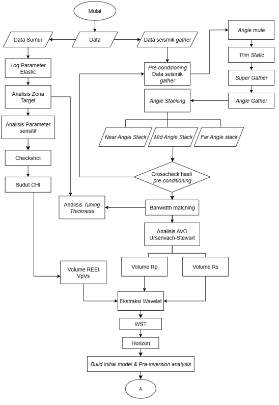
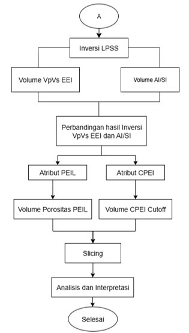
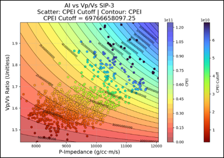
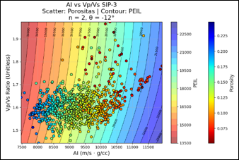
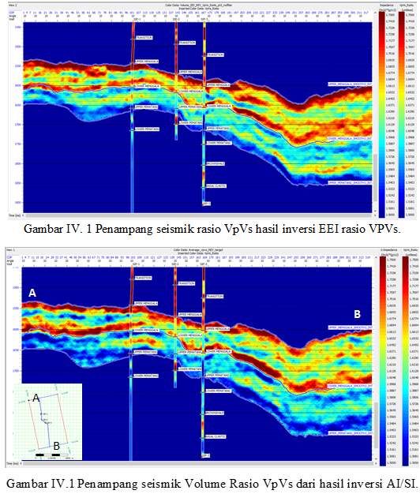
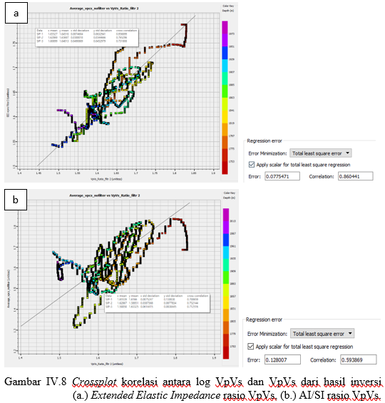
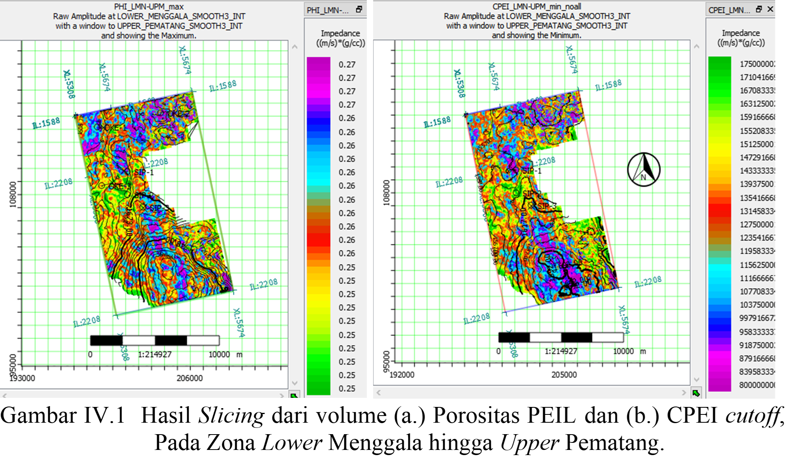
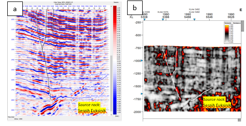

# Reservoir Characterization of Menggala Formation Sandstone Reservoir using a Trigonometric Approach to Pseudo Elastic Impedance Lithology (PEI-L) and Curved Pseudo Elastic Impedance (CPEI) Attributes in the “YUNORA” Field, Central Sumatra Basin

[-blue.svg)](https://itb.ac.id)

[%20%7C%20Excel-green)](#)

Official Publication: [ITB Digital Library Repository](https://digilib.itb.ac.id/gdl/view_data/karakterisasi-reservoir-batupasir-formasi-menggala-menggunakan-pendekatan-trigonometri-terhadap-atribut-pseudo-elastic-impedance-lithology-pei-l-dan-curved-pseudo-elastic-impedance-cpei-pada-lapangan/?rows=605&per_page=44)
---

## Overview

Repository ini berisi ringkasan metodologi, alur kerja pemrosesan data, dan hasil penelitian **Tugas Akhir Sarjana Program Studi Teknik Geofisika ITB** oleh **Siti Asih Rahmahaya**, di bawah bimbingan **Ignatius Sonny Winardhi, Ph.D.** dan **Ekkal Dinanto, S.T., M.T.**

### Key Challenges & Objectives
- **Problem:** Target reservoir batupasir Formasi Menggala di Lapangan "YUNORA" memiliki ketebalan di bawah batas resolusi vertikal seismik (*tuning thickness*), sehingga sulit dipisahkan menggunakan inversi deterministik konvensional.
- **Solution:** Mengaplikasikan pemrosesan data AVO lanjutan (aproksimasi Ursenbach-Stewart) dan **Inversi Extended Elastic Impedance (EEI)** berbasis **Linear Programming Sparse Spike (LPSS)**, yang dikombinasikan dengan pendekatan fungsi **trigonometri** untuk membentuk atribut:
  1. **PEI-L (Pseudo Elastic Impedance Lithology):** Memetakan persebaran porositas secara lateral.
  2. **CPEI (Curved Pseudo Elastic Impedance):** Mengindikasikan keberadaan dan pemisahan saturasi hidrokarbon.

---

## Tech Stack & Software
- **Software:** Petrel & Hampson-Russell (HRS) Suite
- **Programming & Analysis:** Python (AVO Ursenbach-Stewart, EEI Chi Angle Optimization, Numerical Inversion, Data Plotting), Microsoft Excel
- **Dataset:** 3D PSTM Gather Seismik, 3 Data Sumur (SIP-1, SIP-2, SIP-3) & Data Kecepatan

---

## Workflow & Methodology

   

---

## Key Technical Steps:
1. **Seismic Pre-Conditioning:** Angle Muting ($0^\circ-40^\circ$), Trim Statics, Super Gather ($3 \times 3$), Angle Gather, dan Bandwidth Matching.
2. **AVO & Inversion:** Ekstraksi volume $R_p$ dan $R_s$ menggunakan aproksimasi Ursenbach-Stewart (2008), dilanjutkan inversi LPSS untuk P-Impedance, S-Impedance, dan EEI $V_p/V_s$.
3. **Trigonometric Attribute Formulation:**
   $$\text{PEIL} = -AI^n \left(\frac{V_p}{V_s}\right) \sin\theta + AI^n \left(\frac{V_s}{V_p}\right) \cos\theta$$
   $$\text{CPEI} = AI^n \left(\frac{V_p}{V_s}\right) \cos\theta + AI^n \left(\frac{V_s}{V_p}\right) \sin\theta$$

---

## Key Findings & Results

- **Parameter Sensitivity:** Kombinasi rasio $V_p/V_s$ dan *Acoustic Impedance* (AI) terbukti sangat sensitif memisahkan litologi batupasir bersih (*clean sandstone*) berporositas tinggi dari serpih (*shale*), khususnya pada interval Lower Menggala hingga Upper Pematang.
  

   

- **EEI Inversion Performance:** Volume $V_p/V_s$ dari inversi EEI menghasilkan korelasi yang jauh lebih tinggi terhadap data *well log* dibandingkan hasil inversi AI/SI konvensional.

   

- **Prospective Zones:** 
  - Prospek utama hidrokarbon teridentifikasi di area **Utara** (tinggian struktural).
  - Potensi akumulasi di area **Selatan** dihubungkan oleh sesar berarah **NW-SE** yang bertindak sebagai jalur migrasi dari *source rock* (serpih euksinik Formasi Upper Pematang) menuju reservoir Formasi Menggala.

  

  

---

## Citation Guidelines

Jika Anda merujuk atau menggunakan hasil penelitian dari Tugas Akhir ini, harap sertakan sitasi berikut:

- **Bahasa Indonesia:**
  > Rahmahaya, S. A. (2025): *Karakterisasi Reservoir Batupasir Formasi Menggala Menggunakan Pendekatan Trigonometri terhadap Atribut Pseudo Elastic Impedance Lithology (PEI-L) dan Curved Pseudo Elastic Impedance (CPEI) pada Lapangan "YUNORA", Cekungan Sumatra Tengah*, Tugas Akhir Program Sarjana, Institut Teknologi Bandung.

- **English:**
  > Rahmahaya, S. A. (2025): *Reservoir Characterization of Menggala Formation Sandstone Reservoir using a Trigonometric Approach to Pseudo Elastic Impedance Lithology (PEI-L) and Curved Pseudo Elastic Impedance (CPEI) Attributes in the "YUNORA" Field, Central Sumatra Basin*, Bachelor's Thesis, Institut Teknologi Bandung.

---
© 2025 Siti Asih Rahmahaya — Program Studi Teknik Geofisika, Institut Teknologi Bandung.
