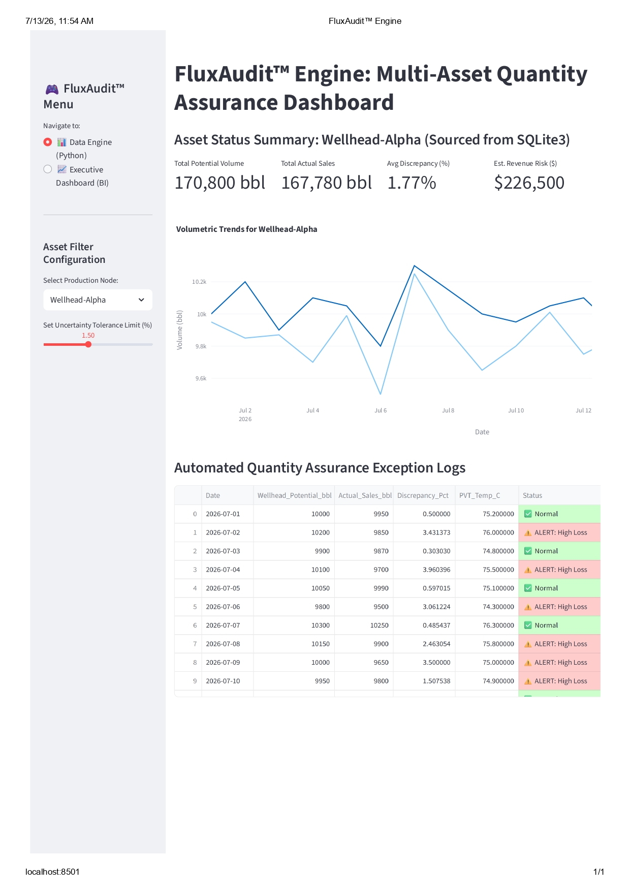
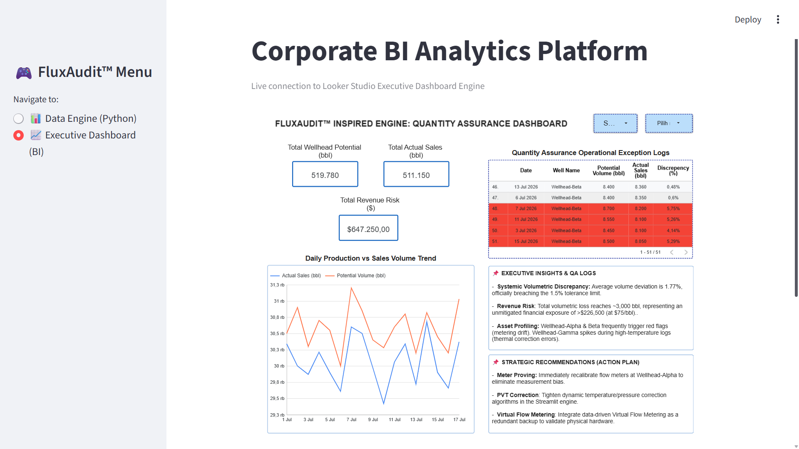

# 🛢️ FluxAudit™ Engine: Multi-Asset Quantity Assurance Consulting Case Study

An end-to-end data analytics pipeline and simulation engine designed to solve **Volumetric Discrepancy (Loss)** issues between upstream wellheads and downstream sales meters in oil and gas production networks. This framework is tailored as a consulting case study for midstream quantity assurance operations.

---

## 🎯 Project Background & Intent
**Note:** This project was **independently developed and engineered** as a **professional portfolio** submission for the **Junior Consultant** position at **BIA Energi**. It demonstrates practical proficiency in data pipeline architecture, database analytics, and executive-level business intelligence solutions tailored specifically for oil & gas consulting workflows. All operational logs and production metrics utilized throughout this application consist of **fully synthetic data** generated purely for simulation and validation purposes.

---

## 📸 Application Preview & System Integration

### 1. Multi-Page User Interface Layouts

#### Page A: 📊 Data Engine (Python & SQLite3 Runtime Backend)


#### Page B: 📈 Executive Dashboard (Integrated Corporate BI Analytics)


---

### 🔄 Dynamic & Integrated Architecture Lifecycle
The *FluxAudit™ Engine* does not rely on static hardcoded values. Instead, it features a **fully integrated structural loop** designed to deliver single-source-of-truth analytics:
1. **Relational Database Sync:** The core Streamlit runtime engine establishes a direct, live gateway connection to the embedded `SQLite3` database layer (`FluxAudit_simulation.db`).
2. **Automated Computation:** Whenever raw data or operational logs inside the database undergo any structural modification (e.g., adding new daily logs or altering production rows), the Python aggregation pipeline instantly recalculates the quantitative parameters (`Discrepancy_bbl`, `Discrepancy_Pct`, and `Est. Revenue Risk ($)`).
3. **Live UI Refresh:** The frontend dashboard, key metric cards, and Plotly trends update dynamically in real-time without requiring manual script redeployment, giving field engineers and stakeholders instant visibility into asset network containment integrity.

---

## 🎯 Problem Statement & Business Context
In oil and gas operations, a common critical issue is the systemic volume mismatch between **Total Wellhead Potential** and **Actual Sales Volume**. As a Junior Consultant, this project evaluates the structural losses and provides data-driven mitigation plans:
* **Global Asset Loss:** Historical operations exhibit an average volume deviation of **1.77%**, officially breaching the standard **1.5% maximum uncertainty tolerance limit**.
* **Financial Risk:** The cumulative unaccounted fluid loss has reached approximately **~3,000 bbl**. Under a benchmark crude market price of **$75/bbl**, this variance represents an unmitigated dynamic revenue risk exposure of **>$226,500**.

---

## 🛠️ Tech Stack & Architecture
* **Database Engine:** SQLite3 (Embedded SQL logic for real-time loss & percentage discrepancy calculations).
* **Simulation Core:** Python 3 (Pandas, NumPy for condition-based anomaly tagging).
* **Interactive UI:** Streamlit Web Framework (Multi-page configuration).
* **Business Intelligence:** Looker Studio (For executive-level cross-filtering and financial risk tracking).

---

## 🚀 Key Features

### 1. 📊 Data Engine & SQL Processing (Python)
* Real-time multi-asset aggregation utilizing optimized SQL queries to compute allocation errors directly inside the database layer.
* Dynamic sidebar adjustment for uncertainty tolerance thresholds.
* Automated red-flag exception logs highlighting high-loss assets based on thermodynamic PVT temperature logs.

### 2. 📈 Corporate BI Analytics Platform (Looker Studio Embed)
* Live integrated dashboard tracking global performance benchmarks.
* Executive-level insight card logging system.
* Direct monitoring of global financial risk values ($) to expedite operational meter-proving decisions.

---

## ⚙️ How to Run the Application Locally

```bash
# 1. Clone the repository and enter the main folder
git clone [https://github.com/sitiasihrahmahaya-prog/AsihPortofolio.git](https://github.com/sitiasihrahmahaya-prog/AsihPortofolio.git)
cd AsihPortofolio

# 2. Navigate to this specific project folder
cd "05. FluxAudit - Oil & Gas Consulting"

# 3. Install all required dependencies
pip install -r requirements.txt

# 4. Execute the Streamlit engine
streamlit run app.py
```
---

## 📌 Executive Insights & Strategic Actions (Consultant Deliverables)
* **High-Temperature Thermal Correlation:** Based on cross-asset correlation analysis, the most severe volume deviations are heavily clustered around Wellhead-Gamma, which consistently logs PVT temperatures well above the operational baseline. This strongly indicates that the current allocation matrix fails to account for thermal volume shrinkage effects.

* **Cumulative Fluid Loss Exposure:** While daily variance percentages appear minor (fluctuating between 1% to 2%), the cumulative unallocated loss has rapidly compounded to ~3,000 bbl. This confirms that the variance is systemic rather than random operational noise, requiring immediate technical intervention.

---

## 💡 Operational & Financial Recommendations
* **Targeted Meter Recalibration:** Immediately schedule priority meter-proving and physical instrument recalibration at Wellhead-Alpha and Wellhead-Beta, which exhibit the highest frequency of threshold breach alerts in the automated exception logs.

* **Dynamic PVT Correction Integration:** Upgrade the core SQL/Python calculation layer to implement standard ASTM/API volume correction factors (VCF) to dynamically neutralize the high-temperature shrinkage errors identified at Wellhead-Gamma.

* **Early Warning Deployment:** Leverage this Streamlit pipeline as a real-time operational dashboard to trigger immediate maintenance workflows the moment any asset breaches the 1.5% maximum uncertainty tolerance limit, preventing further bottom-line revenue leakage.
